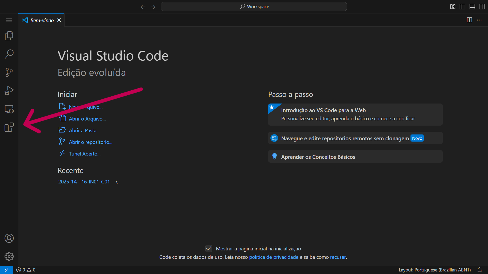
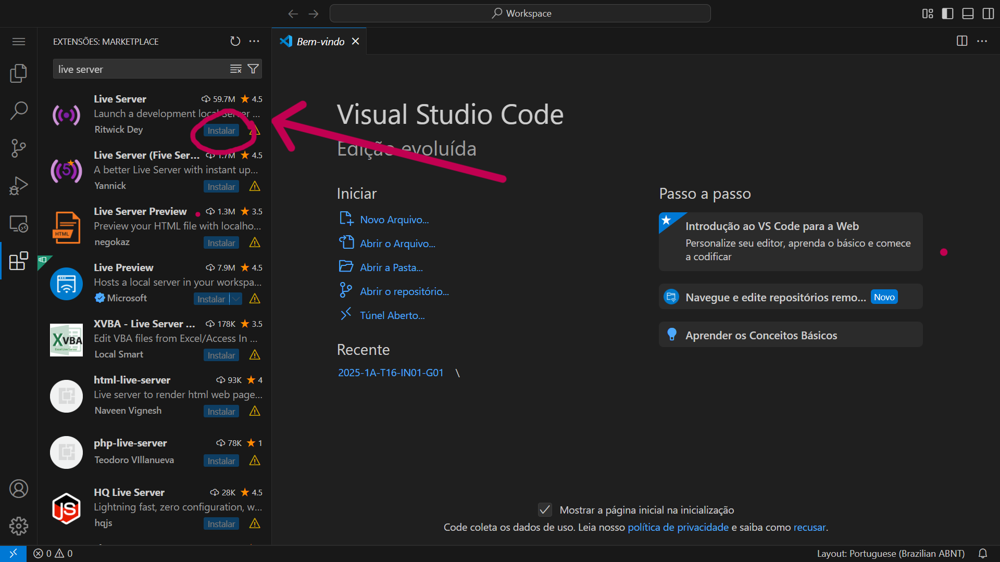
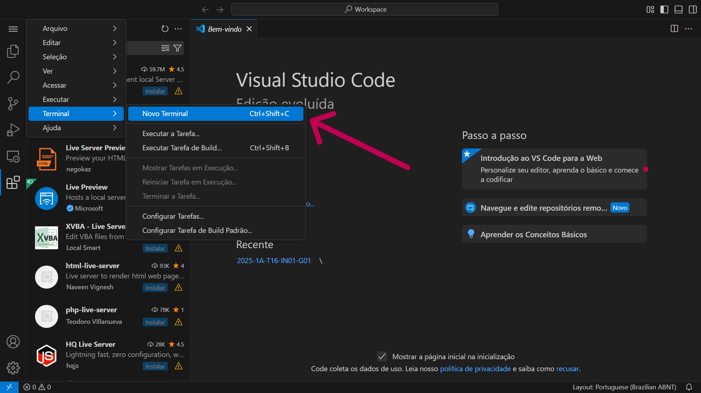
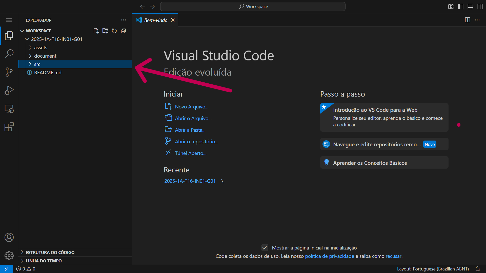
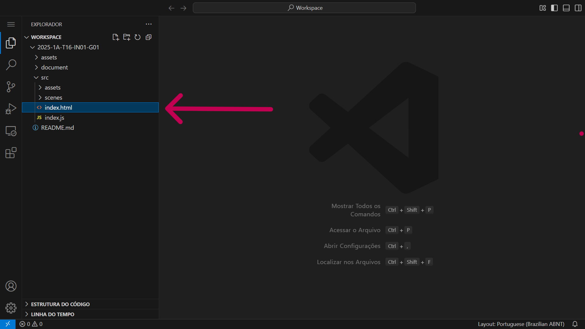

# Inteli - Instituto de Tecnologia e Liderança 

<p align="center">
<a href= "https://www.inteli.edu.br/"></a>
</p>

<br>

# Nome do projeto: codeBreaker

## Nome do grupo: Undefined

## 👨‍🎓 Integrantes: 
- <a href="https://github.com/marianalreis">Mariana Lacerda Reis</a>
- <a href="https://github.com/jlimaz">José Antônio Ferreira de Lima</a>
- <a href="https://github.com/m4rcusml">Marcus Felipe dos Santos Valente</a> 
- <a href="https://github.com/enzopiolcerutti">Enzo Piol Cerutti</a> 
- <a href="https://github.com/rebeca-namura">Rebeca Namura Sbroglio</a>
- <a href="https://github.com/bielbrand/bielbrand">Gabriel Brand Goldsztajn</a> 
- <a href="https://github.com/PatrickMurachovsky">Patrick Natan Murachovsky</a>

## 👩‍🏫 Professores:
### Orientador(a) 
- <a href="#">Claudio Fernando André</a>
### Instrutores
- <a href="https://br.linkedin.com/in/bryan-kano">Bryan Kano Ferreira</a>
- <a href="https://github.com/brunamayer">Bruna Mayer Costa</a> 
- <a href="#">Renato Penha</a> 
- <a href="#">Fernando Pizzo Ribeiro</a>
- <a href="#">Marcelo Luiz do Amaral Gonçalves</a> 

## 📜 Descrição

O jogo inicia com um programador iniciante enfrentando uma crise dentro do sistema bancário do BTG Pactual e está perdido por não entender sobre o contexto bancário específico. Um erro crítico ocorre, fazendo com que o personagem seja transportado para o interior do seu computador e código. O objetivo é que o jogador complete o processo de integração (onboarding), adquirindo  conhecimentos sobre áreas, como fundos de investimento, para conseguir retornar ao mundo real. A dinâmica do jogo combina elementos de quebra-cabeça, aventura e simulação de programação, através de minigames. O jogador interage com o código, corrigindo falhas e completando tarefas para avançar. A versão inicial foca em uma interação básica com o código-fonte e a área de trabalho. O jogo também visa  ensinar os valores da empresa e visão do BTG Pactual. A "escape run" pode ser estruturada com base na jornada do personagem, que precisa desviar de obstáculos e resolver enigmas ligados a diferentes áreas do banco, como fundos de investimentos e cultura organizacional. Em cada fase, o jogador encontrará documentos informativos e enigmáticos (substituindo as moedas tradicionais de outros jogos de plataforma), os quais podem conter pistas para os enigmas ou informações. Ao decifrar esses enigmas, o jogador poderá retomar o jogo no ponto em que o personagem parou. Caso contrário, perderá uma vida e reiniciará a fase atual. Ao receber documentos informativos, o personagem absorve a informação e retoma o jogo a partir de seu progresso, podendo utilizar esse conhecimento em fases subsequentes. O quiz e os enigmas serve para avaliar o conhecimento do novo colaborador sobre a empresa e suas políticas, conceitos e informações de maneira dinâmica. Ele pode apresentar perguntas interativas, como conectar tópicos com suas respectivas definições, e o jogador deverá associar corretamente cada tópico à definição correspondente. Dependendo das respostas, o jogo pode liberar informações adicionais, levando o jogador a explorar as diversas áreas e desafios da empresa. Além disso, o jogo de tomada de decisão simula a tomada de decisões e as consequências dessas escolhas no ambiente corporativo, com foco nos valores e na cultura organizacional do BTG. O novo colaborador assume o papel de um personagem dentro de uma simulação e deve tomar decisões sobre como lidar com situações cotidianas, como negociações financeiras, relacionamento com clientes, dilemas éticos e decisões de investimentos. As escolhas feitas afetam a pontuação final.

## 📁 :file_folder: Estrutura de pastas
Dentre os arquivos e pastas presentes na raiz do projeto, definem-se:
- **assets**: aqui estão os arquivos relacionados a elementos não-estruturados deste repositório, como imagens.
- **document**: aqui estão todos os documentos do projeto, como o Game Development Document (GDD) bem como documentos complementares, na pasta "other".
- **src**: Todo o código fonte criado para o desenvolvimento do projeto do jogo.
- **README.md**: arquivo que serve como guia e explicação geral sobre o projeto e o jogo (o mesmo que você está lendo agora).

## 🔧 Como executar o código

### Pré-requisitos

Para a execução do código em uma máquina local, são necessários uma série de softwares e arquivos. Segue uma lista com os softwares e o link para sua instalação:

**Github e Git**

O [Github](https://github.com/) é uma ferramenta online que permite armazenar e organizar o versionamento de código na forma de repositórios. Dessa maneira, desenvolvedores são capazes de gerenciar versões dos seus projetos e contribuir com edições, apontar erros e tantas outras possibilidades.

Utiliza-se o Git como sistema para realizar o versionamento de código que o Github armazena. Faça o download do Git clicando [aqui](https://git-scm.com/downloads).

**Visual Studio Code**

O [Visual Studio Code](https://code.visualstudio.com/) é um editor de código que utilizaremos para executar nosso código.

Faça o download do software clicando [aqui](https://code.visualstudio.com/), em caso de dúvidas, confira [neste link](https://code.visualstudio.com/learn/get-started/basics) como fazer o download e o _setup_ básico do Visual Studio Code.

**Live server**

O Live Server é uma extensão do Visual Studio Code que cria um servidor local para a execução e visualização de páginas web.

Dentro do Visual Studio Code, pesquise por "Live Server" através da página de extensões (Figura 1). E, em seguida, efetue o download da extensão como indicado (Figura 2). 

<div align="center">
<sup> Figura 1 - Localização da aba de extensões</sup> <br>
 <br>
<sup> Fonte: Material produzido pelos autores, 2025</sup>
</div>

<div align="center">
<sub> Figura 2 - Instalando Live Server</sub> <br>
 <br>
<sub> Fonte: Material produzido pelos autores, 2025</sub>
</div> <br>

Cabe ressaltar que podem haver diferenças visuais, tais como cores e fontes, nos softwares, derivadas de modificações e personalizações, entretanto, o posicionamento das abas será o mesmo em qualquer dispositivo.


### Como executar
Siga os passos descritos abaixo para executar o jogo em seu dispositivo:

**Clonar repositório**

Com o Git e o Visual Studio Code instalados, crie uma pasta nos seus arquivos e a abra dentro do Visual Studio Code selecionando a opção exposta na Figura 3 e escolhendo a pasta de interesse.

<div align="center">
<sub> Figura 3 - Abrindo pasta</sub> <br>
 <br>
<sub> Fonte: Material produzido pelos autores, 2025</sub>
</div> <br>

Após escolher a pasta de destino e acessá-la via Visual Studio Code, teremos que realizar a clonagem do repositório do jogo.

Para isso, dentro da pasta escolhida, deve-se abrir um terminal , um espaço onde podemos dar comando "diretos" ao computador. Primeiro abra a aba "view" (Figura 4), e em seguida selecione a opção "terminal" (Figura 5).

<div align="center">
<sub> Figura 4 - Aba de view</sub> <br>
 <br>
<sub> Fonte: Material produzido pelos autores, 2025</sub>
</div> <br>

<div align="center">
<sub> Figura 5 - Abrir terminal</sub> <br>
 <br>
<sub> Fonte: Material produzido pelos autores, 2025</sub>
</div> <br>

Após os passos anteriores, deve-se digitar o seguinte comando no terminal:
``` git
git clone https://github.com/Inteli-College/2025-1A-T16-IN01-G01.git
```

**Abrir com live server**

Após alguns instantes, será feito o download de uma pasta com uma série de arquivos. Esses são os arquivos do nosso jogo que foram clonados no seu dispositivo (Figura 6).

<div align="center">
<sub> Figura 6 - Abrir terminal</sub> <br>
 <br>
<sub> Fonte: Material produzido pelos autores, 2024</sub>
</div> <br>

Por fim, basta que se clique no arquivo "index.html" com o botão direito e se selecione a opção "Open with Live Server" (Figura 7).

<div align="center">
<sub> Figura 7 - Arquivo index.html</sub> <br>
 <br>
<sub> Fonte: Material produzido pelos autores, 2024</sub>
</div> <br>

Após esses passos, será aberto um servidor local onde você poderá jogador nosso jogo.

## 🗃 Histórico de lançamentos

* 0.1.0 - 13/02/2025
    * Criação das mecânicas de movimentação do jogador como dash, deslizar na parede e pular na parede
    * Cena livre para teste de movimentação

## 📋 Licença/License

<p  xmlns:cc="http://creativecommons.org/ns#"  xmlns:dct="http://purl.org/dc/terms/"><a  property="dct:title"  rel="cc:attributionURL"  href="https://github.com/Intelihub/Template_M1">MODELO GIT INTELI</a> by <a  rel="cc:attributionURL dct:creator"  property="cc:attributionName"  href="https://github.com/Intelihub/Template_M1">Inteli</a>, Mariana Lacerda Reis, José Antônio Ferreira de Lima, Marcus Felipe dos Santos Valente, Enzo Piol Cerutti , Rebeca Namura Sbroglio, Gabriel Brand Goldsztajn, Patrick Natan Murachovsky is licensed under <a href="http://creativecommons.org/licenses/by/4.0/?ref=chooser-v1"  target="_blank"  rel="license noopener noreferrer"  style="display:inline-block;">Attribution 4.0 International</a>.</p>
